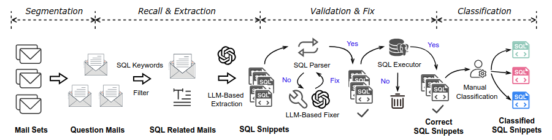
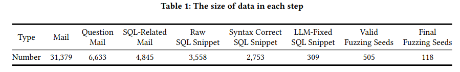

# In-Depth Investigation of SQL Snippets From Communities for Mutation-Based-Fuzzing
  []()  []() []() 
>This project is about extracting the SQL snippets from Postgres Bug Emailing list as fuzzing seeds to improve the mutation-based-fuzzing process. With the assistance of large language model, we mining the useful SQL snippest from the unstructure data.


## Overview


## 🔧 Setup

This project uses **Conda** for environment and dependency management. All packages are listed in [`environment.yml`](./environment.yml).

### Setup & Usage

```bash
# Clone the repository
git clone https://github.com/Zrealshadow/ComFuzzSeeds.git
cd ComFuzzSeeds

# Create and activate the environment
conda env create -f environment.yml
conda activate fuzz  # replace with name in environment.yml
```

### Dependencies
This project requires the following dependencies:
- Python 3.8+
- PostgreSQL 15+
- Required Python packages listed in `environment.yml`
- Make (for building and running scripts)


## Usage

This process involves a series of scripts to clean the unstructured data. Details of how to use are shown in follows.

During this process, all temporary and intermediate data are stored in `tmp` directory


**<<<1>>>: Download mbox files**

Download the mbox files from [link](https://www.postgresql.org/list/pgsql-bugs/) into the `data` directory.


**<<<2>>>:  Segment and filter mbox files into mail message** 

One mbox file contains several emails and we only consider the Question email as our target.

execute the `segement.sh` file, which will filter out the message and title of question emails.


**<<<3>>>: Rule-based filter mails**

execute `filter.py` file, which checks whether the content of email contains any Postgres grammar keywords via regrex expression. It will removed about {4000} unused emails.


**<<<4>>>: LLM-based filter mails**

execute `llm_extract.py`, which utilize the large language model to extract the SQL snippets from raw text.


**<<<5>>>: syntax check**

```sh
$ make
$ ./syntax_check.sh
```

execute above commands. the extracted SQL snippets will be checked by Postgres parser to check the syntax.


**<<<6>>>: broken SQL snippet fixing**

```sh
$ python collect_flaw_sqls.py
$ python llm_fixer.py
$ ./filter_syntax_fixed_sqls.sh
```

execute above commands, the flawed SQL snippets will be fixed by large language model. Then, these fixed SQL snippet will be fed into the Postgres parser to check the syntax again. The still broken SQL snippet will be removed. 


**<<<7>>>: Collect cleaned SQL snippet**

```sh
$ python collect_correct_sql.py
$ python collect_fixed_sqls.py
```


## Results



The final cleaned SQL snippets are stored in `classified_seeds` directory. The SQL snippets are ready to be used as fuzzing seeds for mutation-based fuzzing. 

Any Fuzzing research can directly get the SQL snippets from `classified_seeds` directory for their fuzzing process.

> For the whole technique report, please refer to [ComFuzzSeeds: An In-Depth Investigation of SQL Snippets From Communities for Mutation-Based-Fuzzing](./report/report.pdf).


## License
This project is licensed under the MIT License. See the [LICENSE](./LICENSE) file for details.